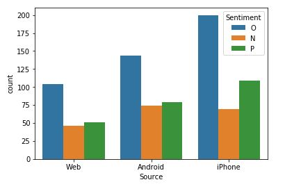
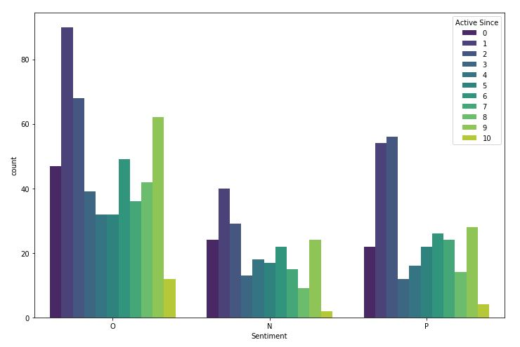
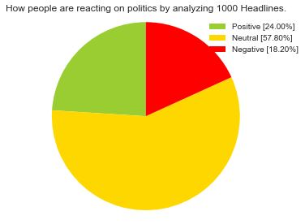
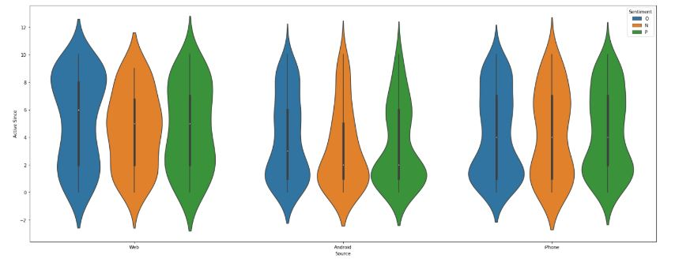

# Social-Sentiment-Analysis

Analyse ongoing sentiments on twitter as well as subreddits of your choice by searching keywords using these python scripts.

# Example screenshots

We can see that the ratio of Positive to Negative is more for iPhone users, where as on Android people are equally likely to be Pos or Neg. Also the most uncertain people fall on the iPhone side. **Making uncertain people into Positive is much easier than making negative people positive, so rather we should target on the iPhone segment.**

This graph shows the count of all sentiments filtered by account activities. **Underlines the credibility of said sentiments.**

Sentiment analysis over a specific subreddit. **Highlights how a specific subreddit is doing in terms of behaviour.**

New accounts use android phones. Older accounts seem to source their posts from web.

